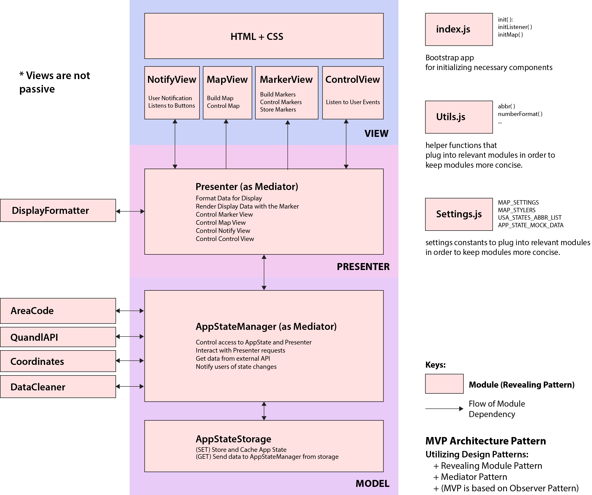

# House-Price Comparison MAP

This project allows user to compare house prices interactively across the US.
This is fulfilled as part of Thinkful.com capstone project required for passing.
The Project was created solely by Chaiyaporn Chinotaikul, under the guidance
and feedbacks of Joel Wallis (a mentor at Thinkful).

It can be viewed at: https://tian-chaiyaporn.github.io/thinkful-capstone-1/

## Architecture

The Project utilizes the following architecture:

### Improvements for future

Since this project is time sensitive, some improvements which are good but not necessary for the app to work are left out at this stage.

- Make some modules smaller: while the Architecture is fine, some modules may need to be even smaller
- Add script logic to index.html to use self-hosted libraries (jQuery, Bootstrap, ...) rather than CDN, in case the CDN fails to load
- Consider adding an observer/subscriber abstraction layer for better maintainability (useful when adding new modules in the future - see Joel's example in MVP playground).
- NotificationViewControl function in Presenter module is a little hard to read logically, change it to be simpler.
- Changes to gulpfile.js : while it works well in building the project, some functionalities are a remnant of previous app versions (inject of global sass variables), and should be cleaned up.
- Reformat spacing so it appears correctly in GitHub
